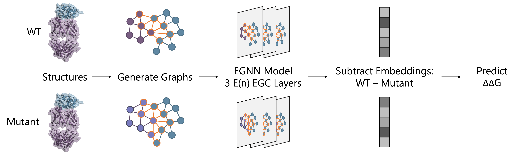

# Investigating the Volume and Diversity of Data Needed for Generalizable Antibody-Antigen ∆∆G Prediction
## Graphinity: Equivariant Graph Neural Network Architecture for Predicting Change in Antibody-Antigen Binding Affinity
<p align="center">

</p>

Code to accompany the paper titled: "Investigating the volume and diversity of data needed for generalizable antibody–antigen ΔΔG prediction" (Nature Computational Science, 2025)

Paper: https://www.nature.com/articles/s43588-025-00823-8

Equivariant graph neural network (EGNN) code developed by Constantin Schneider and Alissa Hummer.


## Abstract
Antibody–antigen binding affinity lies at the heart of therapeutic antibody development: efficacy is guided by specific binding and control of affinity. Here we present Graphinity, an equivariant graph neural network architecture built directly from antibody–antigen structures that achieves test Pearson’s correlations of up to 0.87 on experimental change in binding affinity (ΔΔG) prediction. However, our model, like previous methods, appears to be overtraining on the few hundred experimental data points available and performance is not robust to train–test cut-offs. To investigate the amount and type of data required to generalizably predict ΔΔG, we built synthetic datasets of nearly 1 million FoldX-generated and >20,000 Rosetta Flex ddG-generated ΔΔG values. Our results indicate that there are currently insufficient experimental data to accurately and robustly predict ΔΔG, with orders of magnitude more likely needed. Dataset size is not the only consideration; diversity is also an important factor for model predictiveness. These findings provide a lower bound on data requirements to inform future method development and data collection efforts.


## Synthetic ∆∆G Datasets
We generated synthetic ∆∆G datasets by mutating the interfaces of structurally-resolved complexes from SAbDab (Dunbar et al., 2014; Schneider et al., 2021) using FoldX (942,723 mutations; Schymkowitz et al., 2005) and Rosetta Flex ddG (20,829 mutations; Barlow et al., 2018). For more detail, please see the paper.

<p align="center">

</p>


The PDBs can be downloaded from https://doi.org/10.5281/zenodo.15384945 (excluding PDB files for the FoldX mutant complexes, owing to dataset size restrictions) and https://opig.stats.ox.ac.uk/data/downloads/affinity_dataset/ (all PDB files).
  - FoldX (942,723 mutations):
    - WT: synthetic_foldx_ddg_wt_pdbs.tar.gz (303 MB compressed; 2.6 GB uncompressed)  
    - Mutant: synthetic_foldx_ddg_mutated_pdbs.tar.gz (195 GB compressed; 768 GB uncompressed)  
  - Flex ddG (20,829 mutations):
    - WT: synthetic_flexddg_ddg_wt_pdbs.tar.gz (7.8 GB compressed; 37 GB uncompressed)
    - Mutant: synthetic_flexddg_ddg_mutated_pdbs.tar.gz (7.8 GB compressed; 37 GB uncompressed)


## Requirements
The requirements to run the EGNN model code are included in the graphinity\_env\_cuda102.yaml file. A conda environment can be created from this file with
```
conda env create -f graphinity_env_cuda102.yaml
```

Installing the environment from the yaml file can take up to several hours.

If errors are encountered with the PyTorch Geometric installation, we recommend uninstalling and reinstalling the following packages (in the following order, with the versions specified):

```
pip uninstall torch-scatter torch-sparse torch-geometric torch-cluster torch-spline-conv

pip install torch-scatter==2.0.8 -f https://data.pyg.org/whl/torch-1.8.0+cu102.html --no-cache-dir
pip install torch-sparse==0.6.12 -f https://data.pyg.org/whl/torch-1.8.0+cu102.html --no-cache-dir
pip install torch-geometric==1.6.3 --no-cache-dir
pip install torch-cluster==1.5.9 -f https://data.pyg.org/whl/torch-1.8.0+cu102.html --no-cache-dir
pip install torch-spline-conv==1.2.1 -f https://data.pyg.org/whl/torch-1.8.0+cu102.html --no-cache-dir
```

An alternative to installing from the yaml file, the environment can also be created by running the commands below. This approach is faster, expected to take on the order of 10-30 minutes, depending on the machine.
```
conda create --name graphinity_env_cuda102 python=3.7.10
conda activate graphinity_env_cuda102

conda install pytorch==1.8.0 cudatoolkit=10.2 -c pytorch

pip install torch-scatter==2.0.8 -f https://data.pyg.org/whl/torch-1.8.0+cu102.html --no-cache-dir
pip install torch-sparse==0.6.12 -f https://data.pyg.org/whl/torch-1.8.0+cu102.html --no-cache-dir
pip install torch-geometric==1.6.3 --no-cache-dir
pip install torch-cluster==1.5.9 -f https://data.pyg.org/whl/torch-1.8.0+cu102.html --no-cache-dir
pip install torch-spline-conv==1.2.1 -f https://data.pyg.org/whl/torch-1.8.0+cu102.html --no-cache-dir

conda install conda-forge::openbabel
pip install biopython
pip install numpy
pip install pandas
pip install pyarrow
pip install pyyaml
pip install biopandas
pip install pytorch-lightning==1.2.10
pip install tqdm
pip install wandb
```

Graphinity can also be run without a GPU. The environment can be created without CUDA as follows:
```
conda create --name graphinity_env_no_cuda python=3.7.10
conda activate graphinity_env_no_cuda

conda install pytorch==1.8.0 -c pytorch

pip install torch-scatter==2.0.8 --no-cache-dir
pip install torch-sparse==0.6.12 --no-cache-dir
pip install torch-geometric==1.6.3 --no-cache-dir
pip install torch-cluster==1.5.9 --no-cache-dir
pip install torch-spline-conv==1.2.1 --no-cache-dir

conda install conda-forge::openbabel
pip install biopython
pip install numpy
pip install pandas
pip install pyarrow
pip install pyyaml
pip install biopandas
pip install pytorch-lightning==1.2.10
pip install tqdm
pip install wandb
```

Graphinity has been tested on Linux and Mac. The results in the paper are from Graphinity trained and tested on Linux with 1 GPU (NVIDIA RTX 6000) and 4 CPUs.


## Example inference
Example configuration and input files to run Graphinity are included in example/ddg_synthetic/FoldX/.

A small test (5 mutations, example/ddg_synthetic/FoldX/example_test/) can be run from the root directory via the following commands:

CPU-only:
```
python3 src/ddg_regression/graphinity_inference.py -c example/ddg_synthetic/FoldX/example_test/configs/config-example_test.yaml
```

With a GPU:
```
python3 src/ddg_regression/graphinity_inference.py -c example/ddg_synthetic/FoldX/example_test/configs/config-example_test-gpu.yaml
```

This test took less than 20 seconds to run with 1 CPU (on Linux and Mac) and 1 GPU + 1 CPU (on Linux). The expected outputs are included in example/ddg_synthetic/FoldX/example_test/outputs/preds_Graphinity-example_test.csv.

For more information, see example/ddg_synthetic/FoldX/.


## Example training
Example configuration and input files to train Graphinity are included in example/ddg_synthetic/FoldX/example_train/.

CPU-only:
```
python3 src/ddg_regression/train.py -c example/ddg_synthetic/FoldX/example_train/configs/config-example_train.yaml
```

With a GPU (recommended):
```
python3 src/ddg_regression/train.py -c example/ddg_synthetic/FoldX/example_train/configs/config-example_train-gpu.yaml
```

For more information, see example/ddg_synthetic/FoldX/example_train/.


## Citation

```
@article{Hummer2025,
	title = {Investigating the volume and diversity of data needed for generalizable antibody–antigen ΔΔG prediction},
	author = {Alissa M. Hummer and Constantin Schneider and Lewis Chinery and Charlotte M. Deane},
	journal = {Nature Computational Science},
	doi = {10.1038/s43588-025-00823-8},
	URL = {https://www.nature.com/articles/s43588-025-00823-8},
	year = {2025},
}
```
